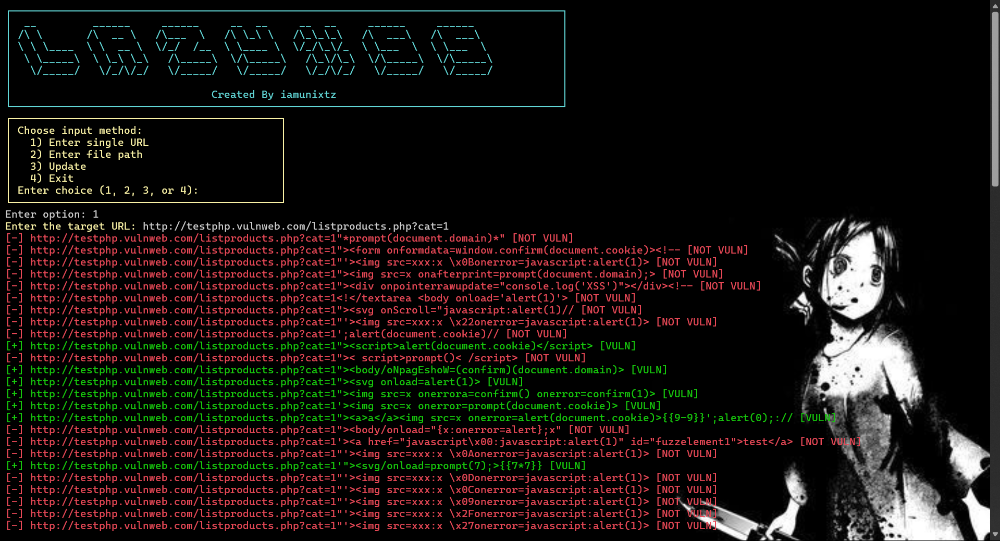

<h1 align="center">LazyXSS - Advanced Reflected XSS Scanner</h1>

<p align="center">
  
  
  
  <br>
  
  
  <br>
  
</p>

LazyXSS is an advanced, async-powered tool to detect and confirm **reflected XSS vulnerabilities** using Playwright (headless browser automation). It scans URLs for reflected payloads, confirms execution in the browser, and generates a modern HTML report.

## 🚀 Key Features

* **Async Reflected XSS Detection** using Playwright
* **Reflection Filtering** with aiohttp before full testing
* **HTML Report Generator** with a futuristic UI
* **Auto-Update via Git** from prompt menu
* **Interactive CLI UI** for input and actions
* **Colored Logs** and real-time scan feedback
* **Graceful Interrupt Handling**
* **Randomized User-Agents** per request
* **Custom Payload File Support**

## 🛠 Installation

### Linux (Debian/Ubuntu)

```bash
sudo apt update && sudo apt install python3 python3-pip git -y
pip3 install -r requirements.txt
playwright install
```

### Windows

1. Install [Python 3.x](https://python.org) (check "Add to PATH")
2. Install dependencies:

```bash
git clone https://github.com/iamunixtz/LazyXss.git
cd LazyXss
pip install -r requirements.txt
playwright install
```

## ⚙️ Usage

```bash
python lazyxss.py
```

You will be prompted to:

* Enter a single URL or file path
* Choose payload file
* Update tool
* Exit

### Example Options:

```bash
python lazyxss.py -u "https://example.com?q="
python lazyxss.py -f urls.txt -p payloads.txt -o output.txt
python lazyxss.py -f urls.txt -t 100 -T 2.5
```

---

## 📁 Output

* All vulnerabilities are saved to `result.txt`
* HTML reports are saved as `result_page_1.html`, `result_page_2.html`, etc.

---

## 🔄 Update

You can update the tool via the prompt menu:

```text
  3) Update
```

It will automatically fetch and pull changes from GitHub.

## 📸 Screenshots

> 


## ☕ Support

If you like this project, consider supporting:

<div align="center">
  <a href="https://buymeacoffee.com/iamunixtz">
    
  </a>
</div>


## 📜 Disclaimer

> This tool is for **authorized security testing** and **educational purposes** only.
> Scanning sites without permission is illegal.


**Author:** [iamunixtz](https://github.com/iamunixtz) | [Twitter/X](https://x.com/iamunixtz)
